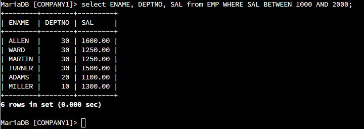

## Using the `mysql`: Script Description
 **Listing all Employees whose salary is greater than 1,000 but not 2,000. Show the Employee Name, Department and Salary.** 

The Script, 
```
select ENAME, DEPTNO, SAL from EMP WHERE SAL BETWEEN 1000 AND 2000;
```


To select the the specified columns, we specify them in after key words **select**, this keyword 
allows for selection in **from ** specified table; in this case columns `ENAME, DEPTNO, SAL` are specified. However this
selection is based on condition **Employee must have salary ranging btn 1000 and 2,000 ** so 
in that case ther conditional keyword is used `where`, the where allows specification of the condition
now the`BETWEEN` keywords is used in the condition. `BETWEEN` returns true if the in the range
`BETWEEN 1000 AND 2000;`.
## Script 2
 **Number of people in department 30 who receive a salary and a commission.** 

The Script, 
```
select count(*)from EMP WHERE DEPTNO=30 and COMM IS NOT NULL;
```


In this Script the `count(*)` is used to all rows that fulfill the following condition. then `is not null` returns the true if specified column(s) is not empty.
The above the Script it returns the rows that have values of the specified column (`COMM`). therefore script returns number of rows which have value at `commission` column

## Script 3
 **Name and salary of employees having salary greater or equal to 1,000 and live in Dallas.** 

The Script, 
```
select EMP.ENAME, EMP.SAL from EMP join DEPT on EMP.DEPTNO=DEPT.DEPTNO 
where EMP.SAL>=1000 and DEPT.LOC="Dallas";
```

The `SELECT` statement is used to retrieve the desired columns, which are the employee name `(ENAME)` and salary `(SAL)`.

The `FROM` clause specifies the table employee and the table department

The `JOIN` keyword is used to combine the employee and department tables based on the common column `DEPTNO`.

The `ON` keyword is used to define the join condition, which is matching the` DEPTNO` in both tables.

The `WHERE` clause is used to apply the specified conditions: `SAL >= 1000` for the salary condition and `LOC = 'Dallas'` for the location condition.

## Script 4
 **All departments that do not have any current employees.** 

The Script, 
```
select DEPT.DEPTNO,DEPT.DNAME from DEPT left join EMP on 
DEPT.DEPTNO=EMP.DEPTNO where EMP.DEPTNO is null;
```


The `SELECT` statement is used to retrieve the department number `(DEPT.DEPTNO)` and department name `(DEPT.DNAME)` columns.

The `FROM` clause specifies the table department

The `LEFT JOIN` keyword is used to combine the department table with the employee table based on the common `column DEPTNO.` This will include all departments, even if they don't have any matching employees.

The `ON` keyword is used to define the `join condition`, which is matching the `DEPTNO` in both tables.

The `WHERE` clause filters the result by checking for `NULL` values in the  `EMP.DEPTNO` column. This condition ensures that only departments without any matching employees are included in the result.

## Script 5
 **Listing the departments' number and the average salary and count of employees of each department.** 

The Script, 
```
SELECT DEPTNO, AVG(SAL) AS AverageSalary, COUNT(EMPNO) AS EmployeeCount
from EMP group by DEPTNO;
```


The `SELECT` statement is used to retrieve the department number `(DEPTNO)`, average salary `(AVG(SALary))`, and count of employees `(COUNT(EMPNO))`.

The `FROM` clause specifies the table employee 

The `GROUP BY` clause is used to group the results by department number `(DEPTNO)`.
The `AVG() `function calculates the average salary for each department, and the `COUNT()` function counts the number of employees in each department.